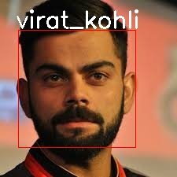

# whosThatCricketer
Evolv challenge 
<h1>Use data_processing.ipynb file to access the code</h1>
<h3>for this challenge i used indian cricketer dataset from kaggle</h3> 

For this i created a hybrid model containing cnn and ann. cnn is used for detecting features and scaling down the image for better prediction. 

<h3>here my dataset had 783 images of 15 indian players which i splited into 9:1 for training and testing purposes.
accuracy achieved was 98.34%</h3>  
use case for this model will be we can took picture of the player and using haarcascades detect face and resize it to the dimensions (64,64,3) and the model 
should be able to find who is that cricketer. 
another use case is that we can use webcam for feeding the images and ultimately prdicting how similar the image is to a part5icular cricketer.

<h2>here is the test case for the image</h2>

